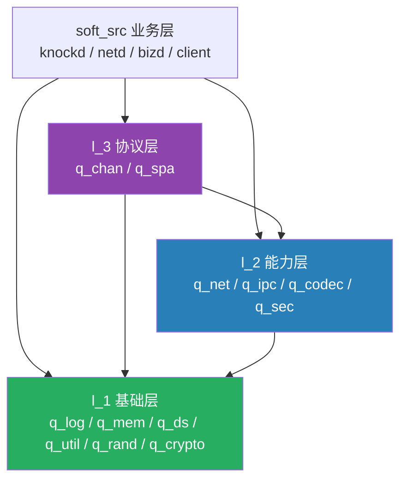

# cs\_dev 开发环境 AI 编程约束技能规则

本文档为 **cs\_dev 统一开发环境** 专属 AI 编程约束规则，所有 AI 代码生成、修改、编译、调试、重构行为必须严格遵守本目录规范、编码规范、工程规范，适配C/S架构安全项目开发（**等保三级 + 国密 + 公网暴露护网场景**），禁止随意创建、修改、移动工程目录文件，保证项目结构统一、可编译、可跨平台部署、符合护网安全规范。

> **技术栈基线（强制）**：服务端 纯C + Linux + 自研 epoll reactor；客户端 GTK4 + 纯C；密码库 **Tongsuo（铜锁）**；算法 **SM2/SM3/SM4**；通信协议 自研私有协议。
> **已废弃选型（禁止使用）**：Qt（C++）、libuv、LibreSSL、RSA2048、AES\-GCM。

## 一、工程目录绝对规范（强制遵守）

cs\_dev 为项目根开发目录，固定子目录用途如下，AI 所有开发行为严格对应目录分工，禁止跨目录存放代码、资源、编译产物：

- **bin/**：仅存放编译完成的可执行程序、最终产出二进制文件（Linux/macOS可执行文件、Windows exe程序），禁止存放源码、头文件、库源码、配置脚本

- **dll/**：仅存放 Windows 平台编译产出的动态链接库（\.dll）、静态库（\.lib），专属Windows平台依赖库文件，禁止存放跨平台库、源码、头文件

- **include/**：仅存放编译阶段统一拷贝的公共头文件（\.h/\.hpp），为项目全局统一头文件目录，禁止直接编写业务源码、禁止存放库源码，所有编译依赖头文件统一归集至此

- **lib/**：仅存放 Linux、macOS 平台编译后的库文件（\.so/\.a/\.dylib），专属类Unix平台编译库产物，与dll目录严格平台区分，禁止混杂存放

- **lib\_src/**：所有自定义底层库、加密库、通信库、工具库**源代码目录**，底层公共能力源码全部存放于此，编译后产物自动输出至 lib/（Linux/macOS）、dll/（Windows）。**目录按依赖层级强制分为 l\_1 / l\_2 / l\_3 三级，逐级向上调用，严禁反向依赖**（详见 3\.3）：

    - **l\_1/ 基础层**：零项目内依赖，只依赖 libc / OS syscall / 开源库
    - **l\_2/ 能力层**：只能调用 l\_1
    - **l\_3/ 协议层**：可调用 l\_2 与 l\_1

- **open\_src/**：仅存放第三方开源源码、开源依赖（**Tongsuo（铜锁）国密密码库**、FFmpeg、OLLVM等开源组件），禁止修改开源源码核心逻辑，自定义适配补丁单独标注

    > **禁止引入 LibreSSL（不含国密 SM2/SM3/SM4）与 libuv（网络层自研 epoll reactor）**

- **shell/**：存放项目公共shell脚本、编译脚本、部署脚本、环境初始化脚本、护网巡检脚本，为全局公共脚本目录，业务代码禁止存入

- **soft\_src/**：项目核心业务源代码目录，所有自研业务源码必须存放于此，**按进程隔离架构划分固定子目录**：

    - **knockd/**：SPA 单包授权进程（UDP 包校验 + nftables 动态放行），代码量严格控制在 **500 行以内**，仅授予 `CAP_NET_ADMIN`
    - **netd/**：协议进程（SM2 密钥协商、SM4\-GCM 解包、字段校验、限流），公网暴露，**非 root + chroot + seccomp，无 DB 凭据、无文件写权限**
    - **bizd/**：业务进程（业务逻辑、数据库、权限、审计、视频流调度），持有 DB 凭据，**仅监听 Unix Socket，不直接暴露公网**
    - **client/**：GTK4 客户端业务代码（UI 与纯C通信内核解耦，UI 操作只允许主线程）

## 二、AI 目录操作强制约束

1. **禁止私自新建目录**：未经明确指令，AI不得在cs\_dev根目录及子目录新建文件夹、自定义目录层级，严格遵循现有目录架构

2. **禁止文件乱存放**：源码、头文件、库文件、编译产物、脚本、开源文件严格对应归属目录，出现目录错位需主动纠正并告知用户

3. **编译产物分离**：所有源码编译结果必须输出至对应平台产物目录：Linux/macOS产物至lib/、Windows库产物至dll/、可执行程序统一至bin/

4. **头文件统一归集**：所有lib\_src、soft\_src编译所需公共头文件，编译完成后必须统一拷贝至 include/，保证全局编译引用统一；**lib\_src 各 `q_xxx` ；**公共基础头文件（`include_*.h`）平铺于 include/ 根目录**，由所有库按需引用

5. **源码与产物隔离**：src类目录（lib\_src/soft\_src/open\_src）仅保留源码，不存放编译产物、临时文件、日志文件、缓存文件

## 三、AI 代码开发规范（适配C/S护网安全项目）

### 3\.1 源码分层开发约束

1. **lib\_src 开发规范**：仅开发底层通用能力，**不编写任何业务逻辑**，代码高内聚、可复用、无业务耦合；**必须按 l\_1 / l\_2 / l\_3 分层存放**。

    **【库命名强制规范】**

    - 模块**目录名以 `q_` 开头**：`q_log`、`q_crypto`、`q_net`
    - **编译产物（库文件名）以 `libq` 开头，且【不含下划线】**：`libqlog.a` / `libqlog.so`（Windows：`qlog.lib` / `qlog.dll`）
    - **换算规则**：`l_1/q_log` → `libqlog`；`l_2/q_net` → `libqnet`；`l_3/q_chan` → `libqchan`（即「`libq` + 去掉下划线与 `q_` 前缀后的模块名」）
    - **链接参数同步去下划线**：`-lqlog`、`-lqnet`、`-lqchan`，**严禁写成 `-lq_log`**
    - 模块对外头文件：`q_xxx.h`（置于模块根目录）；C 源码统一放 `api/` 目录（`q_xxx_*.c`，每个函数一个源文件）；详见下方「库目录内部结构强制规范」
    - **禁止**把多个模块合并成一个库、**禁止**一层只产出一个库

    **【库目录内部结构强制规范】**

    每个 `q_xxx` 模块目录必须包含以下固定结构，**禁止零散摆放源文件 / 测试 / 头文件**：

    | 条目 | 名称 | 用途 / 强制要求 |
    |---|---|---|
    | 聚合头 | `headers.h` | 本库**统一聚合头文件**，集中 `#include` 本库所需的全部 `include_*.h` 公共基础头（`include_stdio.h` / `include_time.h` / `include_thd.h` / `include_net.h` / `include_xml.h` 等）；**禁止在 `api/` 下的 .c 中直接写 `#include "include_*.h"`**，一律经 `headers.h` 引入 |
    | 构建 | `Makefile` | 模块构建文件，首行引入 `include/Makefile.inc` |
    | 对外头 | `q_xxx.h`（及本库其它 `.h`） | 对外 / 内部头文件，编译后归集至 `include/` |
    | 源码 | `api/` | **C 源代码目录**，放所有 `q_xxx_*.c` 实现（每个函数一个源文件） |
    | 测试 | `ut/` | **单元测试 / 小程序目录**，放本库各函数的测试小程序（如 `q_xxx_xxx_ut.c`），用于独立编译验证 |

    **源文件引用铁律**：`api/` 下的每个 `.c` 头部只需两行：

    ```c
    #include "headers.h"   /* 本库聚合的公共基础头（已在其中包含所需 include_*.h） */
    #include "q_xxx.h"     /* 本库对外头，及必要的本库内部 .h */
    ```

    - **禁止**在 `.c` 中直接引用 `include_*.h`，也**禁止**把公共头内容复制 / 内联进模块内
    - 本库内部共享结构体、常量、静态内联辅助函数统一放在 `q_xxx.h` 或本库自有内部头中，由 `headers.h` 之后引入
    - `headers.h` 与 `q_xxx.h` 位于模块根目录，`api/`、`ut/` 下的 `.c` 经编译 `-I`（模块根）解析 `#include "headers.h"` / `#include "q_xxx.h"`，无需写相对路径

    **l\_1 基础层（零项目内依赖，仅依赖 libc / OS syscall / 开源库）**

    | 模块 | 产出库 | 职责 |
    |---|---|---|
    | `l_1/q_log/` | `libqlog` | 日志输出、分级、审计格式化 |
    | `l_1/q_mem/` | `libqmem` | 内存池、缓冲区、安全清零（`explicit_bzero`） |
    | `l_1/q_ds/` | `libqds` | 数据结构：动态数组、最小堆、哈希表、环形队列、位图、滑动窗口 |
    | `l_1/q_util/` | `libqutil` | 通用工具：字节序、hex、base32、时间、配置读取 |
    | `l_1/q_rand/` | `libqrand` | 密码学安全随机源 |
    | `l_1/q_crypto/` | `libqcrypto` | 国密原语封装（SM2 签名/密钥交换、SM3 哈希/KDF/HMAC、SM4\-GCM、PBKDF2\-SM3、HMAC\-SM3 TOTP），基于 Tongsuo，**禁止自研算法** |

    **l\_2 能力层（只能调用 l\_1）**

    | 模块 | 产出库 | 职责 |
    |---|---|---|
    | `l_2/q_net/` | `libqnet` | socket 跨平台封装、**epoll ET reactor**、timerfd 定时器、有界线程池、客户端阻塞收发（**禁止引入 libuv**） |
    | `l_2/q_ipc/` | `libqipc` | Unix Domain Socket 封装（netd 与 bizd 进程间通信） |
    | `l_2/q_codec/` | `libqcodec` | 帧头（pkt\_hdr）解析/序列化、TLV 编解码、字段校验表（**仅做结构编解码，不做加解密**） |
    | `l_2/q_sec/` | `libqsec` | 密钥派生（SM3\-KDF）、防重放（seq 滑动窗口）、PoW、限流计数器 |

    **l\_3 协议层（可调用 l\_2 与 l\_1）**

    | 模块 | 产出库 | 职责 |
    |---|---|---|
    | `l_3/q_chan/` | `libqchan` | **已合并原 `l_3/q_proto`**（§3.3.3 例外登记：同层禁止互调，故并入单一 l\_3 模块）：安全通道（SM2 协商时序 + SM4\-GCM 收发 + AAD 组装 + 通道绑定）+ 协议语义（连接状态机、指令分发、会话 / Token 绑定）；链接 `-lqcodec -lqsec -lqnet -lqcrypto -lqrand -lqmem -lqlog` |
    | `l_3/q_spa/` | `libqspa` | SPA 单包授权（报文构造 / 解析 / 校验） |

2. **soft\_src 开发规范**：仅开发上层业务逻辑，包含服务端业务处理、**客户端 GTK4 UI 逻辑**、Token会话管理、视频流调度、权限校验等核心业务，调用lib\_src编译后的库能力，禁止重复编写底层工具逻辑

3. **open\_src 开发规范**：仅做开源组件编译、适配、裁剪，禁止修改开源核心算法，所有自定义适配代码隔离存放，便于版本升级、漏洞更新

4. **shell 脚本规范**：所有编译、清理、部署、环境初始化、**SPA nftables 规则**、**systemd 单元**、护网巡检、日志统计脚本统一编写至shell目录，支持一键编译、跨平台构建、产物自动归集

### 3\.2 安全代码强制约束（适配护网场景）

结合项目C/S安全架构，AI生成代码必须遵守以下安全规则，默认开启安全加固：

1. 禁止明文硬编码密钥、协议魔数、密钥配置，所有敏感字符串支持加密存储、运行时动态解密

2. 所有数据包解析必须包含长度校验、边界校验、魔数校验、**seq 序列号校验**、时间戳粗筛，杜绝溢出、畸形包攻击；**未认证状态收到 0x0001\~0x0003 以外指令一律断连并计入 IP 信誉**

3. 加密逻辑统一基于lib\_src底层库实现，业务层禁止自定义加密算法，**统一使用国密 SM2/SM3/SM4 标准体系**；**禁止使用 RSA2048、AES\-GCM、LibreSSL**，口令存储使用 PBKDF2\-SM3（迭代 ≥ 100000）

4. 内存操作安全，密钥、临时敏感数据使用完毕立即清零，避免内存残留泄露风险

5. 客户端代码默认兼容混淆编译、反调试适配，服务端代码默认开启限流、异常日志审计能力

6. **AEAD 使用强制规范**：SM4\-GCM 的 IV 必须由 `nonce_base XOR seq` 派生，**严禁随机生成 IV**（GCM nonce 重用属灾难性失效）；包头全部字段（magic/version/cmd/key\_id/flags/hdr\_len/seq/timestamp/nonce/body\_len）**必须整体作为 AAD 参与认证**；会话 Token **只允许出现在密文体内**，禁止明文传输

7. **防重放强制规范**：以 seq 单调递增滑动窗口为主（仅接受 `[last_seq+1, last_seq+64]`）；**禁止采用"缓存若干分钟 nonce"的实现方式**（存在内存耗尽 DoS 风险）；时间戳仅作粗筛，窗口 ±300 秒

8. **进程隔离强制规范**：解析不可信网络输入的代码只允许出现在 knockd 与 netd；**netd 禁止持有数据库凭据、禁止文件写权限、禁止 root 运行**；bizd 只接受来自 Unix Socket 的可信结构化数据；跨进程数据一律使用 TLV

9. **Fuzz 强制规范**：knockd SPA 解析器与 netd 未认证解析器必须通过 AFL++（或 libFuzzer）7×24 小时零崩溃验证，分支覆盖分别不低于 95% / 90% 方可集成；TLV 编解码 Fuzz 用例纳入 CI 常规执行；**未认证解析器是本项目最高优先级安全投入**

10. **敏感数据与日志规范**：随机数统一使用密码学安全随机源；密钥、口令、OTP 种子等敏感数据使用完毕立即 `explicit_bzero` 清零；**严禁日志明文记录口令、OTP、Token**（Token 仅记录前 8 位的哈希）；审计日志留存 ≥ 180 天并采用 SM3 链式哈希防篡改

### 3\.3 lib\_src 分层依赖强制规范（l\_1 / l\_2 / l\_3）

**依赖方向（严格单向，禁止反向、禁止跨层跳跃）**

> 箭头方向 = **调用方向**（上层 → 下层）



| 层级 | 允许调用 | 禁止调用 |
|---|---|---|
| **l\_1** | libc、OS syscall、**开源库（Tongsuo 等）** | 本项目 l\_1 其他模块（原则上）、l\_2、l\_3、soft\_src |
| **l\_2** | **l\_1**、libc、OS syscall | l\_2 其他模块（原则上）、l\_3、soft\_src |
| **l\_3** | **l\_2、l\_1**、libc、OS syscall | l\_3 其他模块（原则上）、soft\_src |
| **soft\_src** | l\_3、l\_2、l\_1、FFmpeg | — |

**强制约束**

1. **严禁反向依赖**：l\_1 不得引用 l\_2 / l\_3 / soft\_src 的任何头文件与符号；l\_2 不得引用 l\_3 / soft\_src
2. **严禁跨层跳跃**：l\_3 允许调用 l\_1（无需经由 l\_2 转包），但 l\_1 绝不允许向上调用
3. **同层禁止互相调用**：l\_N 内部各模块之间原则上不得互相依赖；确有共享代码时，**必须下沉到下一层**（如 l\_2 两个模块共用逻辑 → 下沉至 l\_1），特殊情况须经用户确认并登记
4. **禁止循环依赖**：任意两个模块间不得形成引用环
5. **第三方库收敛**：**Tongsuo 只允许 `l_1/q_crypto`（产物 `libqcrypto`）直接调用**，上层一律经由 `libqcrypto` 封装接口使用；只有 `q_crypto` 的 Makefile 允许 `LIBS += $(LIB_CRYPTO)`；FFmpeg 例外，允许 `soft_src/client` 与视频模块直接调用
6. **新增模块必须先定层**：新增任何 lib\_src 模块时，AI 必须先声明其**归属层级、`q_` 库名、依赖的 `q_*` 库清单**，三项齐全方可创建
7. **新库必须同步登记三处**：模块目录 `lib_src/l_N/q_xxx/`、`Makefile`（含逐级 `-lq_*` 依赖）、`shell/` 总构建脚本的编译顺序；缺任一处不得提交
8. **创建源代码规则**: 每个函数一个源文件，每个源文件一个 `q_xxx` 函数，每个函数控制在500行以内，最多不超过1500行

**头文件（公共头文件优先复用，禁止重复造轮子）**

- `include/` 下已提供的**公共头文件**（`include_stdio.h`、`include_net.h`、`include_thd.h`、`include_time.h`、`include_xml.h`）**所有库按需直接引用**，不得另写同类头文件、不得复制其内容到模块内
- 新增公共头文件沿用 `include_<模块>.h` 命名，平铺在 `include/` 根目录
- 各 `q_xxx` 模块的**对外头文件**编译后直接拷贝至 `include/`（平铺，不建 `include/l_N/` 子目录），引用形式 `#include <q_xxx.h>`（如 `#include <q_log.h>`）；模块内部聚合头 `headers.h` 仅作 `api/` 源文件聚合入口，**不安装到 `include/`**（注：与 §3.1 目录结构一致）
- 每个库源文件**统一通过本库 `headers.h` 引入所需 `include_*.h` 公共头（禁止直接写 `#include "include_*.h"`），随后引入本库 `q_xxx.h`**（及必要的本库内部 `.h`）；公共头优先复用，禁止重复造轮子。目录结构详见 §3.1「库目录内部结构强制规范」

**产物与 Makefile（每库独立产物，逐级添加依赖）**

- 每个 `q_xxx` 模块**独立编译为一个库**，产物 `libqxxx.a`（静态）/ `libqxxx.so`（动态，**库名不含下划线**），Linux/macOS 输出至 `lib/`，Windows 输出至 `dll/`
- 每个模块目录下**必须有自己的 `Makefile`**，首行引入公共配置（相对路径或 `SOFT_HOME` 绝对路径二选一）：

```makefile
# 例：lib_src/l_3/q_chan/Makefile
# 模块变量必须在 include 之前定义，供 Makefile.inc 的 lib_static/lib_so 正确捕获先决条件
TARGET    = libqchan.a                    # libq + 模块名，无下划线
TARGET_SO = libqchan.so                   # 动态库名（可省略，默认由 TARGET 推导）
OBJS      = q_chan.o q_chan_io.o

# 逐级添加依赖：先 l_2，再 l_1（高级在前、低级在后）
LIBS    += -lqcodec -lqsec -lqnet         # l_2
LIBS    += -lqcrypto -lqrand -lqmem       # l_1
LIBS    += -lqlog                         # l_1

include ../../../include/Makefile.inc     # 或 include ${SOFT_HOME}/include/Makefile.inc
```

- **链接顺序铁律**：本模块 → l\_3 → l\_2 → l\_1（**高级在前、低级在后**）；顺序错误即视为分层违规
- 公共配置 `include/Makefile.inc` 已按“库 / 可执行程序”两类拆分编译链接参数：公共 `CFLAGS`；库专用 `LIB_CFLAGS(-fPIC) / SOFLAGS(-shared) / LIB_LDFLAGS`；可执行程序专用 `BIN_CFLAGS(-fPIE) / LDFLAGS(-pie …)`；并以 `BUILD ?= lib`（模块可覆盖为 `bin`）决定目标文件参数与 `all` 流程。另统一提供 `CC / AR / TARGET / TARGET_SO / LIBS / $(LIB_CRYPTO)` 及 `lib_static / lib_so / install_lib / install_bin / clean / check_layer / format / format-check` 目标；**子 Makefile 只能用 `+=` 追加，禁止重定义 `CC` 或覆盖安全编译参数**
- 提供 `shell/check_layer.sh` 静态扫描：解析所有 `#include` 与本模块 Makefile 的 `-lq*` 列表，上报「l\_N 引用了 l\_M（M > N）」、同层互引、库名含下划线、以及 Makefile 中缺失的下层依赖，作为 CI 必过项
- **代码格式化统一用 clangd / clang-format**：工程根目录已提供 `.clang-format`（样式：4 空格缩进、Allman 花括号、指针靠右、保留 `#include` 顺序）与 `.clangd`（声明 `-Iinclude` 等自定义头路径，使 clangd 无需 `compile_commands.json` 即可解析）；编辑器由 clangd 按 `.clang-format` 自动格式化，命令行用 `make format`（本模块就地重写）/ `make format-check`（CI 检查，不匹配则非零退出）

## 四、AI 编译 \& 构建约束

1. **跨平台构建区分**：编译时自动区分平台，Linux/macOS库产物输出至lib/，Windows库产物输出至dll/，可执行文件统一输出至bin/

2. **头文件引用规范**：所有代码编译统一引用根目录include/公共头文件，禁止分散引用src内头文件，保证编译一致性

3. **编译脚本统一**：所有编译逻辑通过shell目录脚本实现，AI生成编译方案必须基于现有shell脚本体系，禁止零散编译命令

4. **产物纯净性**：编译完成后自动清理临时文件、缓存文件、中间obj文件，仅保留bin/lib/dll最终产物

5. **版本兼容**：支持增量编译、全量编译，区分源码修改编译、开源组件重编译场景，避免无效编译耗时

6. **安全编译选项（强制）**：`-O2 -fPIE -pie -fstack-protector-strong -D_FORTIFY_SOURCE=2 -Wl,-z,relro,-z,now -Wl,-z,noexecstack -ftrapv -Wformat -Werror=format-security -Wconversion`

7. **依赖库约束**：密码能力统一链接 **Tongsuo（铜锁）**；客户端 UI 统一使用 **GTK4**（`GtkColumnView` / `GtkNotebook` / `GtkDrawingArea` + cairo 自绘图表），**禁止使用 Qt（C++）、libuv、LibreSSL**；Windows 库产物至 dll/，Linux/macOS 库产物至 lib/，可执行文件统一至 bin/

8. **客户端线程约束**：GTK4 所有 UI 操作只允许主线程执行，网络/解码线程一律通过 `g_idle_add()` / `g_main_context_invoke()` 投递；无 GPU 环境需支持 `GSK_RENDERER=cairo` 软件渲染

9. **q 库独立产物与逐级链接（强制）**：每个 `q_xxx` 模块独立产出 **`libqxxx.a`**（`libq` + 模块名，**禁止出现下划线**，如 `libqlog.a` / `libqnet.a` / `libqchan.a`），Linux/macOS → `lib/`，Windows → `dll/`；**不得按层合并成单一库**；链接顺序为「本模块 → l\_3 → l\_2 → l\_1」，依赖在本模块 Makefile 中**逐级显式 `-lqxxx` 添加**；每次构建前执行 `shell/check_layer.sh`，违规即中止

10. **公共 Makefile.inc 强制引入**：所有 `lib_src/l_N/q_xxx/Makefile` 与 `soft_src/*/Makefile` 首行必须引入 `include/Makefile.inc`（相对路径或 `${SOFT_HOME}/include/Makefile.inc`），统一使用其中的 `CC / AR / CFLAGS / LDFLAGS / TARGET / LIBS / $(LIB_CRYPTO)` 及标准目标；**禁止在子 Makefile 中重复定义工具链或覆盖安全编译参数**，只允许用 `+=` 追加；`SOFT_HOME` 由公共文件自动推导，推荐在 `shell/` 总构建脚本中 `export SOFT_HOME=<cs_dev根目录>`

11. **公共头文件强制复用**：`include/` 下已有公共头文件（`include_stdio.h`、`include_net.h`、`include_thd.h`、`include_time.h`、`include_xml.h`）为**唯一标准实现**，所有库与业务代码按需 `#include` 引用；**禁止另起炉灶重写同类头文件、禁止拷贝其内容进模块目录**；缺能力时优先在对应 `include_*.h` 中扩展

## 五、AI 应答行为约束

1. 所有代码生成、修改、重构必须**严格匹配目录规范**，输出代码时主动标注文件存放路径

2. 用户提出开发需求时，优先判断文件归属目录，目录错误主动修正并说明原因

3. 新增功能代码必须遵循「底层库放lib\_src（且必须落到 l\_1/l\_2/l\_3 中的正确层级）、业务放soft\_src、开源适配放open\_src、脚本放shell」的分层逻辑；**放置 lib\_src 时必须显式说明归层理由与依赖对象**

4. 涉及编译、部署、环境配置，必须基于现有目录结构输出方案，不新增自定义目录结构

5. 输出代码同时附带简要说明：文件路径、用途、编译方式、适配平台，方便用户落地

6. **技术栈红线**：生成任何代码前必须确认技术栈为「纯C + Tongsuo 国密 + GTK4 + 自研 epoll reactor + 自研私有协议」；若需求描述或既有文档中出现 **Qt、libuv、LibreSSL、RSA2048、AES\-GCM** 等已废弃选型，必须主动指出并按本规则纠正，不得沿用

7. **安全边界红线**：不得将安全寄托于"协议私有不公开"或"客户端混淆"；所有安全控制必须由**服务端强制**执行，设计上需假定协议格式与客户端二进制已完全泄露

## 六、规则生效说明

本规则为 **cs\_dev 开发环境唯一强制AI编程规范**，后续所有代码编写、修改、调试、编译、工程优化、bug修复工作，AI 必须无条件遵守，无特殊豁免场景，所有开发成果保证工程规整、安全合规、跨平台可用、适配护网安全需求。

**技术依据**：《护网加固版C/S架构管理系统技术方案V2（国密修订版）.md》（项目根目录）。协议格式、密码流程、限流阈值、合规要求等细节以该方案为准；本规则与该方案冲突时，**以方案为准并主动上报冲突**。

> （注：部分内容由豆包工作 AI 生成）
