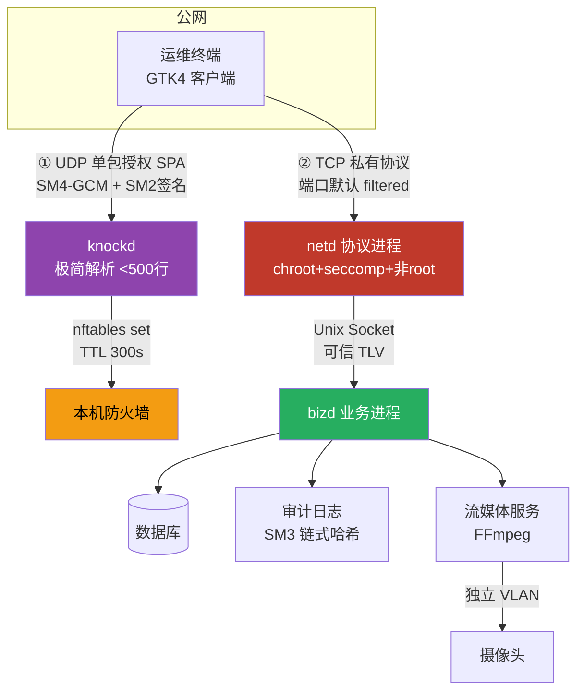

# 护网加固版 C/S 架构管理系统技术方案 V2（国密修订版）

> 版本：V2.0
> 适用定级：网络安全等级保护三级（含商用密码应用安全性评估）
> 项目形态：探路 / 试点项目
> 技术栈约束：服务端纯 C（Linux）、客户端 GTK4 + 纯 C、密码库 Tongsuo（铜锁）

---

## 0. 修订说明

### 0.1 相对 V1 的变更清单

| # | V1 原设计 | V2 修订 | 原因 |
|---|---|---|---|
| 1 | LibreSSL | **Tongsuo（铜锁）** | LibreSSL 无国密算法，不满足密评要求 |
| 2 | RSA-2048 + AES-GCM | **SM2 + SM3 + SM4-GCM** | 等保三级 / GB/T 39786 要求国密 |
| 3 | libuv 事件循环 | **自研 epoll reactor + 线程池** | 去依赖、缩攻击面、自主可控 |
| 4 | GTK（未定版本） | **GTK4（4.14+）** | 明确版本，适配新控件体系 |
| 5 | 无端口隐藏 | **新增 SPA 单包授权（knockd）** | 公网暴露下实现真正的"抗扫描" |
| 6 | 单因素口令 | **口令 + TOTP（HMAC-SM3）双因素** | 等保三级强制双因素鉴别 |
| 7 | 单进程服务端 | **三进程隔离（knockd / netd / bizd）** | 公网暴露，隔离不可信输入解析 |
| 8 | 包头明文未认证 | **整包作为 AAD 参与 GCM 认证** | 修复可篡改 cmd / body_len 的致命缺陷 |
| 9 | 时间戳 ±30s 防重放 | **seq 滑动窗口为主 + 时间戳为辅** | 消除时钟依赖与 nonce 缓存 DoS |
| 10 | 视频 RTSP 内网裸传 | **视频走独立加密通道** | 公网暴露下原方案不成立 |
| 11 | 无三权分立 | **新增系统 / 审计 / 安全三管理员** | 等保三级强制要求 |

### 0.2 关键裁定

- **公网上线，不依赖 VPN / IP 白名单**，依靠 SPA + 纵深防御
- **自研协议封装，密码算法调用已认证的密码库**（合规与安全兼得）
- **客户端技术栈锁定 GTK4 + 纯 C**，通信内核与 UI 解耦
- **不使用 libuv**：服务端仅部署 Linux，只需 epoll；客户端为 GUI，用收包线程即可，跨平台 poller 需求消失

### 0.3 LibreSSL 不可用性裁定

| 密码库 | SM2/SM3/SM4 | 国密 TLCP | 商用密码产品认证 | 结论 |
|---|---|---|---|---|
| **LibreSSL** | ❌ 完全没有 | ❌ | ❌ | **不可用**，密评直接判不符合 |
| OpenSSL 3.x 主线 | ❌ 无国密 | ❌ | ❌ | 不推荐 |
| **Tongsuo（铜锁）** | ✅ 完整 | ✅ GB/T 38636 | ✅ 有认证路径 | **首选** |
| GmSSL 3.x | ✅ 完整 | ✅ | 商业版有 | 备选 |
| 自研实现 | ⚠️ 不推荐 | ❌ | ❌ | 不可（密评高风险项） |

LibreSSL 是 OpenBSD 的精简分支，路线图中从未包含国密算法，其 EVP 层也没有国密 OID。三级等保必过密评，国密是硬门槛，因此 LibreSSL 必须替换为 **Tongsuo**。Tongsuo 为 OpenSSL API 风格（迁移成本极低），国内生态最好，支持 SM2 / SM3 / SM4 / SM9 / ZUC 与 TLCP 协议。

---

## 1. 总体架构

### 1.1 部署拓扑



### 1.2 进程划分与权限

| 进程 | 职责 | 权限 | 暴露面 |
|---|---|---|---|
| **knockd** | SPA 校验 + 防火墙放行 | 仅 `CAP_NET_ADMIN` | UDP 单端口（最高危，代码量最小） |
| **netd** | SM2 协商、SM4-GCM 解包、字段校验、限流 | 非 root、chroot、seccomp、无文件写权限 | TCP 业务端口（公网） |
| **bizd** | 业务逻辑、数据库、权限、审计 | 持有 DB 凭据 | 仅 Unix Socket（不对外） |

**核心价值**：即使 netd 被打穿，攻击者也只能得到一个无 DB 凭据、无文件写权限、syscall 受限的空壳进程。

### 1.3 目录映射（对齐 cs_dev 规范）

```
lib_src/
  net/        socket 跨平台封装、epoll reactor、定时器、线程池、客户端收发
  crypto/     国密封装（SM2/SM3/SM4，基于 Tongsuo）、KDF、OTP、安全清零
  proto/      帧编解码、TLV、状态机、防重放
  ipc/        Unix Domain Socket 封装
  util/       日志、配置、限流、内存池、安全清零
soft_src/
  knockd/     SPA 授权进程
  netd/       协议进程
  bizd/       业务进程（会话、权限、审计、业务）
  client/     GTK4 客户端（UI 与通信内核解耦）
open_src/     Tongsuo、FFmpeg、OLLVM（仅编译依赖，不修改核心算法）
shell/        构建、打包、nftables 规则、systemd 单元、护网巡检脚本
include/      公共头文件
bin|lib|dll/  产物（严格平台分离）
```

---

## 2. 网络层设计（替代 libuv）

### 2.1 平台策略（关键简化）

| 端 | 部署平台 | 网络模型 |
|---|---|---|
| **服务端** | Linux only | 单线程 epoll ET reactor + 独立线程池 |
| **客户端** | Windows / Linux / macOS | 阻塞 socket + 1 个收包线程，无需事件循环 |

因此**不需要跨平台 poller**，只需 `lib_src/net/sock.h` 约 80 行兼容封装（`WSAStartup`、`closesocket`、`ioctlsocket`、`getaddrinfo`）。

### 2.2 epoll reactor（服务端）

```c
typedef struct reactor reactor_t;

reactor_t *reactor_create(int max_conn);
int  reactor_add(reactor_t *r, int fd, uint32_t events, void *udata);
int  reactor_mod(reactor_t *r, int fd, uint32_t events, void *udata);
int  reactor_del(reactor_t *r, int fd);
/* 定时器：timerfd + 最小堆，精度 1ms */
timer_id_t reactor_timer_add(reactor_t *r, uint64_t expire_ms, void (*cb)(void*), void *ud);
void reactor_run(reactor_t *r);
void reactor_stop(reactor_t *r);
```

**自研事件循环必查清单**（这是放弃 libuv 的代价，务必逐项确认）：

- [ ] ET 模式必须**读到 EAGAIN 为止**，漏读会永久丢事件
- [ ] 连接表用**固定数组 + fd 索引**，上限硬编码（如 8192），杜绝动态分配失控
- [ ] 每个连接有**读超时 / 写超时 / 空闲超时**三档定时器
- [ ] `EPOLLRDHUP` 必须处理，否则 CLOSE_WAIT 堆积
- [ ] fd 泄漏检测：开发期开启 fd 计数断言
- [ ] 信号用 `signalfd`，不在 handler 中做复杂逻辑
- [ ] 慢速攻击防护：单连接最小读速率阈值

### 2.3 线程池（承载 SM2 / SM4 / 视频转码）

```c
typedef struct thr_pool thr_pool_t;

thr_pool_t *thr_pool_create(int nthreads, int queue_cap);
/* 队列满则直接拒绝并计数告警，不无限堆积 */
int thr_pool_submit(thr_pool_t *p, void (*fn)(void *), void *arg);
```

- 线程数 = CPU 核数；任务队列**有界**（如 1024）
- **SM2 协商、SM4 大数据块加解密、视频转码**必须提交线程池，否则阻塞主循环
- 会话表由**主线程独占访问**，线程池不直接修改会话状态（避免加锁复杂度）

### 2.4 客户端网络线程（GTK4）

```c
/* 收包线程（pthread） */
static void *recv_thread(void *arg) {
    while (!quit) {
        pkt_t *p = proto_recv_blocking(fd, RECV_TIMEOUT);   /* 阻塞读 */
        if (p) g_idle_add_full(G_PRIORITY_DEFAULT, on_pkt_dispatch, p, pkt_free);
    }
    return NULL;
}
```

GTK4 **所有 UI 操作必须在主线程**，网络线程一律通过 `g_idle_add()` / `g_main_context_invoke()` 投递。

---

## 3. SPA 单包授权（新增核心模块）

### 3.1 原理

SPA（Single Packet Authorization，参考 fwknop）在 TCP 握手**之前**先发送一个加密 UDP 包，服务端验证后动态放行该 IP 的 TCP 端口，TTL 到期自动撤销。

- 未敲门时，TCP 端口在 nmap 中表现为 **filtered** —— 扫描器**看不到端口存在**
- 这才是"抗扫描"真正有效的手段；**"私有协议无特征"做不到这一点**（协议特征靠混淆只能延缓，SPA 是结构性隐藏）

### 3.2 SPA 报文格式（定长头 + 短体，总长 ≤ 256 字节）

```c
/* 全部网络字节序；总长度硬上限 256 字节，超出直接丢弃 */
typedef struct {
    uint8_t  magic[4];       /* 0x53 0x50 0x41 0x01 */
    uint8_t  version;        /* 1 */
    uint8_t  key_id;         /* SPA 密钥版本，支持轮换 */
    uint8_t  msg_type;       /* 1 = OPEN */
    uint8_t  reserved;
    uint32_t timestamp;      /* 秒，±30s 窗口 */
    uint8_t  nonce[12];      /* GCM IV */
    uint8_t  user_id[32];    /* 定长，SM3(用户名) 或固定编号，避免变长解析 */
    uint16_t req_port;       /* 请求放行的端口 */
    uint16_t req_ttl;        /* 请求放行时长（服务端取 min(ttl, 300)） */
    uint8_t  cipher[];       /* SM4-GCM 密文：{ client_ip_hint(16), rnd(16) } */
    /* 紧跟 uint8_t tag[16] */
} spa_pkt_t;
```

**密钥方案**（两档，一期用 A）：

- **A. 每用户 SPA 密钥**：服务端生成 32 字节随机密钥，经 SM2 公钥加密后离线 / 带外分发给用户，客户端配置一次；校验使用 SM4-GCM。
- **B. 每用户 SM2 密钥对**：客户端持有私钥，对 SPA 包做 SM2 签名，服务端验签。可防共享密钥伪造，二期上线。

### 3.3 处理流程（knockd）

```
1. recvfrom() 收包 → 长度合法且 <= 256 ? 否则 return（不响应）
2. 魔数 / 版本 / key_id 校验 → 失败 return
3. SM4-GCM 解密（密钥按 key_id 取）→ 失败 return
4. timestamp ±30s 校验 → 失败 return
5. nonce 唯一性：有界滑动窗口（位图，约 8KB）→ 重复 return
6. 取 UDP 包的【实际源 IP】，忽略报文内的 ip_hint（防 IP 欺骗）
7. nftables: add element spa_allow { <src_ip> timeout <ttl>s }
8. 不回任何响应
```

**强制约束**：

- **任何失败一律静默 return，不发送任何响应** → 天然免疫 UDP 反射放大攻击
- 处理路径保持**恒定时间**，不得有可测量的时序差异
- 报文**定长优先**，变长部分严格上限
- knockd 代码量控制 **< 500 行**，做到可逐行审查

### 3.4 防火墙集成（nftables）

```bash
# 一次性建表（shell/spa_setup.sh）
nft add table inet spa
nft add set inet spa allow4 { type ipv4_addr\; flags timeout\; timeout 300s\; }
nft add chain inet spa input { type filter hook input priority 0\; }
nft add rule inet spa input tcp dport 9000 ip saddr @spa_allow4 accept
nft add rule inet spa input tcp dport 9000 drop      # 未敲门：静默丢弃

# knockd 放行（TTL 自动过期，无需 cron 清理）
nft add element inet spa allow4 { 203.0.113.7 timeout 300s }
```

- **使用 set + timeout 自动过期**，不要手工 `iptables -I` 加定时清理（会导致规则膨胀）
- knockd 只授予 `CAP_NET_ADMIN`：`AmbientCapabilities=CAP_NET_ADMIN`，不给完整 root
- 若部署在云主机，云安全组无法动态修改 → **使用本机 nftables**，云安全组仅做粗粒度兜底

### 3.5 SPA 的局限（必须写清楚）

| 局限 | 说明 | 缓解 |
|---|---|---|
| NAT 共享 IP | 同一出口 IP 下所有用户共享放行窗口 | 放行后仍需完整鉴权，SPA 只是减少暴露 |
| UDP 解析器暴露 | knockd 是第一个接触攻击者的代码 | 极小代码量 + 最高优先级 Fuzz + seccomp |
| 密钥泄露 | 泄露者可直接敲门 | key_id 支持轮换 + 按用户单独吊销 |
| 不替代鉴权 | SPA 通过 ≠ 可访问业务 | 登录 / OTP / Token 一步都不能少 |

---

## 4. 密码体系（国密）

### 4.1 算法映射

| 用途 | 算法 | 标准依据 | Tongsuo API |
|---|---|---|---|
| 服务端长期身份 | SM2 签名（256 位） | GM/T 0003.2 | `EVP_PKEY_SM2` |
| 会话密钥协商 | **SM2 密钥交换**（临时密钥对） | GM/T 0003.3 | `EVP_PKEY_SM2` + 自实现协商 |
| 对称加密 | **SM4-GCM**（主选）/ SM4-CBC + SM3-HMAC（回退） | GM/T 0002 / GB/T 38636 | `EVP_sm4_gcm()` |
| 完整性 / 哈希 / KDF | SM3 | GM/T 0004 | `EVP_sm3()` |
| 随机数 | OS RNG（`getrandom`）+ SM3-DRBF | GM/T 0003.3 KDF | `RAND_bytes` |
| 口令存储 | PBKDF2-SM3，迭代 ≥ 100000，盐 16 字节 | GM/T 0004 | `PKCS5_PBKDF2_HMAC` + SM3 |
| OTP | **HMAC-SM3 TOTP**（可切换 SHA256） | RFC 6238 国密化 | `HMAC()` + SM3 |
| 会话 Token | 32 字节密码学随机，SM3 绑定 | — | `RAND_bytes` |

> **合规说明**：SM4-GCM 套件在 **GB/T 38636-2020（TLCP）** 中定义为 `ECC_SM4_GCM_SM3` / `ECDHE_SM4_GCM_SM3`。若密评机构对 SM4-GCM 有异议，**回退方案为 SM4-CBC + SM3-HMAC（encrypt-then-MAC）**，这是最保守、最不会被挑的组合。建议在预评估阶段确认。

> **SM4 性能预警**：SM4 无 CPU 指令加速（不像 AES 有 AES-NI），软件吞吐约 **100~300 MB/s/核**。多路高清视频需提前实测，不足时使用密码卡硬件加速。

### 4.2 密钥体系

| 密钥 | 生成 | 存储 | 轮换 |
|---|---|---|---|
| 服务端 SM2 长期签名密钥对 | 离线生成 | 私钥存密码模块 / 密码卡；公钥内置客户端 | 支持多版本 `key_id` |
| 临时 SM2 密钥对 | 每次连接生成 | 内存，用完清零 | 每连接 |
| 会话密钥 `K` | SM2 密钥交换 + SM3-KDF | 内存 | 每连接 |
| 用户 SPA 密钥 | 服务端生成，SM2 加密分发 | 服务端 SM4 加密存储 | 可单独吊销 |
| OTP 种子 | 20 字节随机 | 主密钥 SM4-GCM 加密存储 | 用户自助重置 |
| 口令 | PBKDF2-SM3 | 只存哈希 + 盐 | 90 天策略（可选） |
| 主密钥（KEK） | 密码模块 / 密码卡 | 不出密码模块 | 年度 |

### 4.3 密钥协商时序（SM2 密钥交换，前向安全 + 抗中间人）

```
C → S : client_temp_pub(64B) || client_random(32B) || key_id(1B)
S → C : server_temp_pub(64B) || server_random(32B)
        || SM2_Sign(long_priv,
              H = SM3(client_temp_pub || server_temp_pub
                       || client_random || server_random))   (64B)
        || SM4-GCM(K, IV)[challenge 32B] || tag
C     : 用内置 long_pub 验签 → 失败立即断连
        计算共享密钥 Z → KDF(Z) 派生 enc_key / mac_key / channel_id
        解密得到 challenge，原样回传
S     : 校验 challenge → 安全通道建立
C → S : [安全通道内] username || pwd_hash || otp_code || device_id
S → C : 校验 → session_token(32B，与 channel_id 绑定) || 有效期
```

**相比 V1 的关键增强**：

- **前向安全**：临时 SM2 密钥对用完即弃，长期私钥泄露也无法解密历史流量（原 RSA 方案无此性质）
- **抗中间人**：服务端用长期私钥对协商材料签名，客户端用内置公钥验签（原方案完全没有服务端认证）
- **通道绑定**：`channel_id = SM3(K_master)`，Token 与通道强绑定，防止 Token 被挪用到其他连接
- **密钥轮换**：`key_id` 支持内置 2 个长期公钥（当前 + 备用），轮换不必全量升级客户端

### 4.4 密钥派生

```
Z            = SM2 密钥交换共享点
K_master     = SM3_KDF(Z, "master" || client_random || server_random)
enc_key_c2s  = SM3_KDF(K_master, "c2s")    /* SM4 固定 128 位，取前 16 字节 */
enc_key_s2c  = SM3_KDF(K_master, "s2c")
nonce_base   = SM3_KDF(K_master, "nonce")  /* 12 字节，GCM IV 基值 */
channel_id   = SM3(K_master)
```

收发方向使用**不同密钥**，避免双向 nonce 冲突。

**GCM IV 规则（强制）**：

```
IV(12B) = nonce_base XOR seq(4B, 大端填充)
```

IV 由会话唯一基值与包序列号构成，**保证同一密钥下 IV 永不重复**。**禁止随机生成 IV** —— 这是 GCM catastrophic failure 的核心雷区，V1 方案完全未定义 IV。

---

## 5. 数据包协议

### 5.1 帧结构

```c
/* 包头 44 字节，全部作为 AAD 参与 GCM 认证 */
typedef struct {
    uint8_t  magic[4];      /* 0x43 0x53 0x50 0x01 */
    uint16_t version;       /* 协议版本 */
    uint16_t cmd;           /* 指令（未认证态仅允许 3 个值） */
    uint8_t  key_id;        /* 服务端长期公钥版本 */
    uint8_t  flags;         /* bit0 分片 bit1 压缩 bit2-3 通道(0业务/1视频) */
    uint16_t hdr_len;       /* 固定 44，自检 */
    uint32_t seq;           /* 单调递增，主防重放 */
    uint32_t timestamp;     /* 秒，辅助 */
    uint8_t  nonce[12];     /* GCM IV = nonce_base XOR seq */
    uint32_t body_len;      /* 密文长度，硬上限校验 */
    uint32_t reserved;
} __attribute__((packed)) pkt_hdr_t;

/* 密文：SM4-GCM 输出 = cipher[body_len] + tag[16] */
```

**相比 V1 的修正**：

1. **整包作为 AAD** → `cmd / body_len / seq / flags` 不可篡改（修复 V1 致命缺陷）
2. **Token 移入密文体** → 不再明文泄露
3. **`seq` 为主、`timestamp` 为辅** → 无时钟依赖，无 nonce 缓存 DoS
4. **IV 显式定义且由 seq 派生** → 杜绝 GCM nonce 重用
5. **`key_id`** → 支持密钥轮换

### 5.2 TLV 业务体（收敛 Fuzz 面）

```c
typedef struct { uint16_t tag; uint16_t len; uint8_t val[]; } tlv_t;
```

- **全局只有一份 TLV 编解码实现**，业务代码禁止手写偏移解析
- 每个业务接口声明**字段校验表**（tag / 类型 / 最大长度 / 取值范围 / 是否必填），编解码器统一强制校验
- 这样 Fuzz 面集中在 `lib_src/proto/` 一处

### 5.3 指令表（未认证态严格白名单）

| cmd | 名称 | 认证态 | 说明 |
|---|---|---|---|
| 0x0001 | HELLO | 否 | 能力协商 |
| 0x0002 | KEY_EXCHANGE | 否 | SM2 协商 |
| 0x0003 | LOGIN | 否 | 账号 + 口令 + OTP |
| 0x0010 | HEARTBEAT | 是 | 保活 + Token 续期 |
| 0x0020 | BIZ_QUERY | 是 | 业务查询 |
| 0x0021 | BIZ_UPDATE | 是 | 业务变更 |
| 0x0030 | VIDEO_OPEN | 是 | 视频通道 |
| 0x0040 | LOGOUT | 是 | 注销 |

**未认证状态下收到任何非 0x0001~0x0003 指令 → 立即断连并计入 IP 信誉。**

### 5.4 连接状态机

```
NEW ──recv HELLO──> HELLO_DONE ──recv KEY_EXCHANGE──> KEY_DONE
                                                          │
                     recv LOGIN(成功) ──> AUTHED ──> 业务 / 视频 / 心跳
                     recv LOGIN(失败) ──> 计数并断连

任何状态：超时 / 包数超限 / 字节超限 / 校验失败 ──> CLOSED
```

### 5.5 防重放

| 机制 | 实现 | 内存开销 |
|---|---|---|
| **seq 滑动窗口**（主） | 只接受 `[last_seq+1, last_seq+64]` | 固定 2 个整数 / 连接 |
| 时间戳（辅） | ±300s，仅作粗筛 | 0 |
| channel_id 绑定 | Token 与会话密钥绑定 | 0 |

**放弃了 V1 的"缓存 5 分钟 nonce"** —— 那是 OOM 陷阱。滑动窗口天然有界、零内存增长。

---

## 6. 身份鉴别与会话

### 6.1 双因素：口令 + TOTP（HMAC-SM3）

| 项 | 设计 |
|---|---|
| 算法 | TOTP，步长 30s，6 位，**HMAC-SM3**（服务端可配置切换 HMAC-SHA256 以兼容通用 App） |
| 种子 | 20 字节随机，Base32 编码给用户 |
| **绑定设备** | **必须绑定手机 / 独立令牌**，**严禁把种子保存在 PC 客户端** —— 否则与口令同设备，退化为单因素 |
| 服务端存储 | 种子使用主密钥 SM4-GCM 加密存储 |
| 防重放 | 记录 `last_used_step`，只允许 `step > last_used_step` |
| 漂移容忍 | ±1 步长 |
| 失败锁定 | 同账号连续 5 次失败锁定 15 分钟（与口令失败分开计数） |
| 恢复码 | 8 个一次性恢复码，SM3 哈希存储 |
| 管理员 | 一期使用 OTP，二期强制 SM2 UKey（SKF） |

> **合规提示**：等保三级要求"应采用口令、密码技术、生物技术等两种或两种以上组合的鉴别技术"，口令 + OTP 满足要求。**标准 TOTP App 不支持 HMAC-SM3**，若用户需使用 Google Authenticator / 企业微信等，需切换 SHA256 模式。建议服务端做成配置项 `otp_algo = sm3 | sha256`，默认 `sm3`。

### 6.2 登录流程

```
1. [前置] SPA 敲门成功，防火墙放行
2. TCP 连接 → HELLO → KEY_EXCHANGE（SM2 协商 + 服务端签名 + challenge）
3. LOGIN: SM4-GCM{ username, pwd_hash, otp_code, device_id, client_ver }
4. 服务端校验顺序（全部通过才继续）：
   a. 账号存在性（不存在时也走完相同计算路径，防时序侧信道）
   b. 口令 PBKDF2-SM3 校验
   c. OTP 校验（含 step 单调性）
   d. 账号状态（锁定 / 禁用 / 过期）
   e. 设备白名单（可选）
5. 生成 session_token(32B)，
   绑定 { user_id, channel_id, src_ip, device_id, issue_time }
6. 下发 token + 有效期（默认 30 分钟）+ 续期策略
```

### 6.3 Token 设计

| 项 | 设计 |
|---|---|
| 生成 | `RAND_bytes` 32 字节 |
| 绑定 | `user_id` + `channel_id` + `src_ip` + `device_id` |
| 有效期 | 30 分钟，心跳自动续期（滑动续期，非硬过期） |
| 传输 | **仅出现在密文体内**，从不明文传输 |
| 失效 | 过期 / 主动注销 / 管理员强制下线 / 密码修改 |
| IP 变更 | **不立即失效**，改为二次验证（V1 的强 IP 绑定会在 NAT / 移动场景频繁踢人） |
| 存储 | bizd 内存为主，DB 存元数据用于重启恢复与审计 |

### 6.4 未认证阶段限流矩阵

| 维度 | 阈值 | 超限动作 |
|---|---|---|
| 单 IP 并发连接 | ≤ 8 | 拒绝新连接 |
| 单 IP 新建连接速率 | ≤ 5/s | 拒绝 |
| 未认证连接包数 | ≤ 4 个 | 断连 |
| 未认证连接字节数 | ≤ 8 KB | 断连 |
| 未认证连接时长 | ≤ 10s | 断连 |
| 单账号登录失败 | 5 次 / 15 min | 锁定账号 |
| 单 IP 登录失败 | 20 次 / 5 min | 拉黑 30 min |
| 全局并发连接 | 可配（如 4096） | 拒绝 |

### 6.5 PoW 工作量证明（可选，建议一期上线）

登录前要求客户端完成轻量工作量证明：`SM3(challenge || counter)` 前 20 bit 为 0，成本约 5~20ms。

- 对正常用户**完全无感**
- 把批量扫描 / Fuzz 的成本抬高约 1000 倍
- **这是"抗自动化"真正有效的手段**，比"私有协议无特征"可靠得多

---

## 7. 服务端纵深防护

### 7.1 netd 沙箱（systemd）

```ini
[Service]
User=netd
CapabilityBoundingSet=~          # 清空所有 capability
AmbientCapabilities=
NoNewPrivileges=yes
PrivateTmp=yes
ProtectSystem=strict
ProtectHome=yes
ProtectKernelTunables=yes
ProtectKernelModules=yes
ProtectControlGroups=yes
RestrictAddressFamilies=AF_INET AF_INET6 AF_UNIX
MemoryDenyWriteExecute=yes
LockPersonality=yes
RestrictSUIDSGID=yes
ReadWritePaths=/var/log/csdev
SystemCallFilter=@system-service ~@privileged ~@mount ~@keyring
SystemCallArchitectures=native
```

### 7.2 Fuzz（一期最高优先级投入）

| 目标 | 工具 | 要求 |
|---|---|---|
| **knockd SPA 解析器** | AFL++ / libFuzzer | 7×24h 零崩溃，分支覆盖 ≥ 95% |
| **netd 未认证解析器** | AFL++ / libFuzzer | 7×24h 零崩溃，分支覆盖 ≥ 90% |
| TLV 编解码 | libFuzzer + ASan / UBSan | 入 CI，每次提交运行 |

- 未认证解析器是**整个系统最该投入的地方** —— 它是唯一可能被匿名 RCE 的攻击点
- 上线灰度期建议 Release 版本也带 ASan 跑一轮（公网暴露项目值得这点性能损失）

### 7.3 编译加固

```bash
CFLAGS="-O2 -fPIE -pie -fstack-protector-strong -D_FORTIFY_SOURCE=2 \
        -Wl,-z,relro,-z,now -Wl,-z,noexecstack -ftrapv \
        -Wformat -Werror=format-security -Wconversion"
```

### 7.4 其他

- 限制最大包体（默认 1MB，视频通道单独放宽）
- 拒绝空包 / 畸形包 / 未知指令，记录日志但不回显
- 慢速攻击检测（最小读速率）
- 服务端主机：HIDS、二进制完整性监测、非 root 部署

---

## 8. 客户端（GTK4）

### 8.1 组件选型

| 需求 | GTK4 方案 | 备注 |
|---|---|---|
| 窗口 / 应用 | `GtkApplication` + `GtkApplicationWindow` | |
| 多标签页 | **`GtkNotebook`** | GTK4 中仍可用；`AdwTabView` 属 libadwaita，不引入以保持纯 GTK4 |
| 表格 | **`GtkColumnView` + `GListStore` + `GtkSignalListItemFactory`** | GTK4 推荐方案（`GtkTreeView` 已标记 deprecated） |
| 排序 / 筛选 | `GtkSorter` / `GtkFilterListModel` / `GtkCustomSorter` | 原生支持 |
| 分页 | 业务层分页 + 自定义工具栏 | GTK4 无内建分页控件 |
| **图表** | **`GtkDrawingArea` + `gtk_drawing_area_set_draw_func()` + libcairo 自绘** | GTK4 **无内置图表控件**；折线 / 柱状 / 饼图自绘约 500~800 行 |
| 视频渲染 | `GtkDrawingArea`（软解缩放后 RGB）或 `GtkGLArea`（OpenGL） | 一期用 DrawingArea，4~9 路 720p 足够 |
| 对话框 / 表单 | `GtkDialog` / `GtkEntry` / `GtkDropDown` / `GtkPasswordEntry` | `GtkPasswordEntry` 为 GTK4 新增 |

> GTK4 移除了 `GtkContainer`、packing 参数等 GTK3 API。若熟悉 GTK3，需要适应 `gtk_widget_set_margin_*` / `GtkBox` append 的新写法，概念迁移成本不高。

### 8.2 线程模型

```
主线程（GTK）    ← 所有 UI 操作
收包线程         ← 阻塞收包 → g_idle_add() 投递
发送             ← 主线程直接发（或独立发送队列线程）
视频解码线程     ← FFmpeg libavcodec → 帧队列 → g_idle_add() 渲染
```

### 8.3 无 GPU 环境

设置 `GSK_RENDERER=cairo` 走软件渲染（运维终端常见场景）。

### 8.4 打包部署

| 平台 | 方案 |
|---|---|
| Windows | MSYS2 `mingw-w64-x86_64-gtk4` + 自写 `shell/pkg_win.sh` 收集 DLL（或 gvsbuild / MSVC） |
| macOS | Homebrew `gtk4` + `gtk-mac-bundler` |
| Linux | 系统包 `libgtk-4-1`，或打包 AppImage |

### 8.5 客户端加固（定位：提高成本，非安全边界）

- **OLLVM**：仅对**通信内核**（`lib_src/crypto`、`lib_src/proto`）开启控制流平坦化 + 虚假控制流；GTK UI 不混淆（体积大收益低）
- 符号剥离 `strip`；敏感字符串运行时解密
- 反调试（Windows）：检测调试器、反 Dump
- **重要提醒**：客户端运行在攻击者自己的机器上，加固只是延缓逆向，**服务端必须在协议完全公开的前提下仍然安全**

---

## 9. 视频方案（修订）

```
[摄像头 VLAN] --RTSP(内网隔离)--> [采集服务 libavformat 拉流]
                                        ↓ 解复用 → Annex-B H.264/H.265 帧
                                   [独立加密通道: SM4-GCM + seq, flags 通道1]
                                        ↓
                                   [客户端 libavcodec 解码]
                                        ↓
                                   [GtkDrawingArea 渲染]
```

**要点**：

- 视频走**独立 TCP 连接**（独立限流、独立背压），与业务通道分离
- 视频帧**不参与时间戳窗口**（延迟敏感），使用 `seq` + 滑动窗口，**允许丢帧**（视频容忍丢包，业务不容忍）
- GOP 边界可重置 seq 基准
- **性能**：SM4 软件吞吐 100~300 MB/s/核，多路 1080p 需实测；不足时使用密码卡加速
- **摄像头侧**：独立 VLAN + 单向隔离 + 改密 / 升固件基线。摄像头到采集服务若跨网段，明文 RTSP 本身是等保失分项，需加密或将采集服务放入摄像头 VLAN

---

## 10. 审计日志

| 项 | 要求 |
|---|---|
| 内容 | 连接、SPA、登录 / 失败 / 锁定、指令、权限变更、异常包、限流拉黑 |
| 留存 | **≥ 180 天**（《网络安全法》6 个月） |
| 完整性 | **SM3 链式哈希**（每条含上一条哈希），防篡改 |
| 保护 | 只追加文件 + 独立权限；审计管理员**只能读不能删** |
| 敏感信息 | 禁止记录口令、OTP、Token 明文（Token 只记前 8 位的哈希） |

---

## 11. 等保三级 + 密评合规对照

| 要求 | 条款依据 | 本方案实现 | 状态 |
|---|---|---|---|
| 身份鉴别双因素 | GB/T 22239 三级 | 口令（PBKDF2-SM3）+ TOTP（HMAC-SM3） | ✅ |
| **三权分立** | GB/T 22239 三级 | 系统管理员 / 审计管理员 / 安全管理员，权限互斥 | 🆕 需补 |
| 密码产品 GB/T 37092 二级及以上 | GB/T 39786 | 采用 Tongsuo / 认证密码模块 | ✅ |
| 国密算法 | GB/T 39786 | SM2 / SM3 / SM4 | ✅ |
| 传输保密性 + 完整性 | GB/T 39786 | SM4-GCM（AEAD） | ✅ |
| 用户身份鉴别（密码技术） | GB/T 39786 | SM2 签名 / OTP | ✅ |
| **存储保密性 / 完整性** | GB/T 39786 | 口令哈希、OTP 种子 SM4 加密、敏感字段加密 | 🆕 需补 |
| **密钥管理** | GB/T 39786 附录 A | 密钥全生命周期、管理制度、责任岗位 | 🆕 需补 |
| 安全审计 ≥ 6 个月 | GB/T 22239 | SM3 链式日志 + 独立审计员 | ✅ |
| **剩余信息保护** | GB/T 22239 | `explicit_bzero`、临时文件安全删除 | 🆕 需补 |
| **抗抵赖** | GB/T 22239 | 关键操作 SM2 签名留痕 | 🆕 需补 |
| **入侵防范 / 恶意代码防范** | GB/T 22239 | HIDS、二进制完整性监测 | 🆕 需补 |
| **安全管理中心 / 集中管控** | GB/T 22239 三级 | 独立审计服务、集中策略下发 | 🆕 需补 |
| **备份恢复（含异地）** | GB/T 22239 三级 | 本地日备 + 异地备份 | 🆕 需补 |

> **强烈建议**：开工前做一次**密评 / 等保预评估**。密评对"自研协议"的接受度、SM4-GCM 的认可度这两点，先问清楚能省掉后期大改。

---

## 12. 分期计划

### 一期（MVP，验证路线可行性）

| # | 内容 | 里程碑 |
|---|---|---|
| 1 | `lib_src/net` epoll reactor + 线程池 | 5000 并发压测稳定 |
| 2 | `lib_src/crypto` 国密封装（Tongsuo） | SM2/SM3/SM4 单测通过 |
| 3 | `lib_src/proto` 帧 + TLV + 状态机 | Fuzz 7×24h 零崩溃 |
| 4 | `soft_src/knockd` SPA + nftables | nmap 扫描端口为 filtered |
| 5 | `soft_src/netd` + `bizd` 进程隔离 + IPC | 端到端跑通 |
| 6 | 登录 + OTP + Token + 会话 | 双因素可用 |
| 7 | GTK4 客户端：登录 + 2 张表格 | 跨平台可运行 |
| 8 | 审计日志（SM3 链式） | 可溯源 |

**一期四个硬性验收标准**（缺一项说明这条路线有问题）：

1. knockd + netd 未认证解析器 **AFL++ 7×24h 零崩溃**
2. 一次内部渗透（把客户端二进制交给红队，记录多久被打穿）
3. 一次**等保 / 密评预评估**
4. 得出 **C/GTK4 相对 Web 的真实工作量倍数**数据

### 二期

图表（cairo 自绘）、多标签页、RBAC + **三权分立**、存储加密、剩余信息保护、抗抵赖、备份恢复、集中管控

### 三期

视频通道、PoW、客户端 OLLVM 加固、管理员 UKey、SPA 升级为 SM2 签名模式

---

## 13. 风险与规避

| 风险 | 等级 | 规避措施 |
|---|---|---|
| **未认证解析器内存破坏 → 匿名 RCE** | 🔴 最高 | 进程隔离 + 极简代码 + Fuzz + 沙箱 + PoW |
| SPA 解析器被利用 | 🔴 高 | <500 行 + 静默失败 + seccomp + 最高优先级 Fuzz |
| 自研事件循环 bug（ET 漏事件 / fd 泄漏） | 🟠 中 | 见 §2.2 必查清单 + 长稳压测 |
| SM4 性能不足 | 🟠 中 | 提前实测；密码卡加速 |
| SM4-GCM 密评认可度 | 🟠 中 | 预留 SM4-CBC + SM3-HMAC 回退；预评估确认 |
| GCM IV 重用 | 🔴 高 | IV 由 `nonce_base XOR seq` 派生，禁止随机生成 |
| 时钟漂移导致可用性问题 | 🟡 低 | seq 为主，时间戳仅粗筛；强制 NTP |
| 客户端加固被绕过 | 🟡 低 | 定位为提高成本，安全全靠服务端强制 |

---

## 14. 待拍板问题

1. **密码库**：Tongsuo（推荐）还是 GmSSL 3.x？—— 决定所有国密 API 写法，开工前必须确定
2. **SM4 模式**：SM4-GCM（性能好）还是 SM4-CBC + SM3-HMAC（最保守）？—— 建议预评估后确定
3. **OTP 算法**：HMAC-SM3（合规优先，需自研绑定流程）还是 HMAC-SHA256（可用通用 App）？—— 建议做成服务端配置项，默认 SM3
4. **密评预评估**：是否先做？—— 强烈建议

---

## 15. 与 `AI_SKILL_RULE.md.md` 的冲突修正

`AI_SKILL_RULE.md.md` 存在三处与本方案冲突的描述，建议同步修正，避免后续 AI 生成代码时技术栈错乱：

| 位置 | 原文 | 应改为 |
|---|---|---|
| 第 23 行 | "Qt 客户端业务代码" | **GTK4 客户端业务代码** |
| 第 19 行 | "LibreSSL、libuv、FFmpeg" | **Tongsuo、FFmpeg**（不使用 libuv、LibreSSL） |
| 第 57 行 | "统一使用 RSA2048+AES-GCM 标准体系" | **统一使用 SM2/SM3/SM4 国密体系** |
